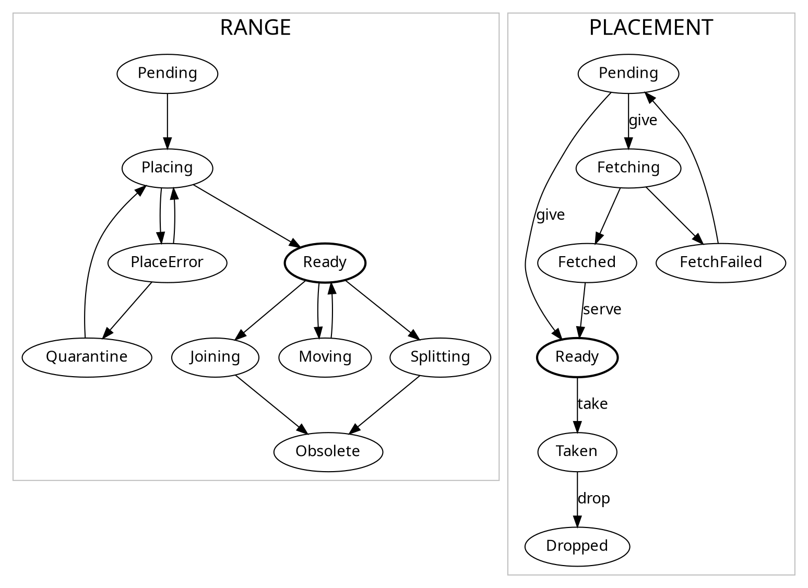

# Ranger

This is an experiment to define a generic interface for stateful range-sharded
distributed storage systems to implement, and a generic master to load-balance
keys between them.

## Development

Regenerate the files in `pkg/proto`

```console
$ bin/gen-proto.sh
```

## State Machine

