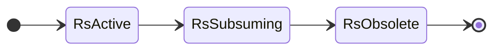
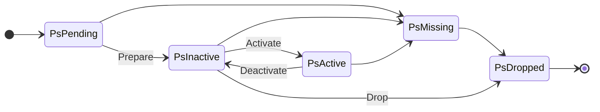
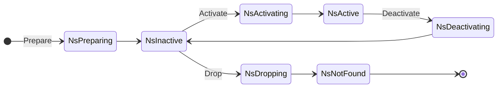

# Ranger

Ranger is a generic range-based sharding framework, inspired by Facebook's
[Shard Manager][sm] and Google's [Slicer][slcr]. It provides a client library
(rangelet) for sharded services to embed, a controller (rangerd) to assign key
ranges to them, and a client (rangerctl) to interact with the cluster. It's
designed in particular to support stateful workloads, which need to move around
large amounts of data in order to rebalance, but should be useful to stateless
workloads wanting key affinity, too.

The goal of Ranger is for generic automatic sharding to be the default choice:
it should be easier to build and operate an automatically sharded service using
Ranger than one which is manually sharded. I'm working on it because I'm
acquainted with many systems which would benefit from such a thing existing.

## Examples

- [cache](examples/cache)
- [key-value store](examples/kv)

## Usage

### Terminology

The terms used by Ranger are standard, but necessarily vague:

- **Key**: The atomic unit of sharding, which cannot be split further. An opaque
  string of arbitrary bytes.
- **Keyspace**: The set of every possible key, from negative to positive
  infinity.
- **Range**: A set of keys from _start_ (inclusive) to _end_ (exclusive) within
  a keyspace.
- **Node**: Any service implementing the [Node interface](#interface) and
  being discoverable by the controller.
- **Placement**: An instance of a Range on a Node. Depending on the replication
  config, might be the only instance of a range, or might be one of many.

### Interface

Services implement the Node interface, via [Go](pkg/api/node.go) or
[gRPC](pkg/proto/node.proto#L9):

- `Prepare(RangeMeta, []Parent) error`  
  Prepare to own the given range. This can take as long as necessary, while the
  node allocates relevant data structures, fetches state, replays logs, warms up
  caches, etc. `Meta` contains the range ID, start key, and end key.
- `Activate(RangeID) error`  
  Accept ownership of the given range. This will only be received after the node
  has finished preparing or (in error conditions) after deactivating the range.
  It should be fast and unlikely to fail.
- `Deactivate(RangeID) error`  
  Relinquish ownership of the given range. This will only be received for active
  ranges. It should be fast and unlikely to fail, and where possible, easy to
  roll back.
- `Drop(RangeID) error`  
  Forget the given range, and release any resources associated with it. All of
  the keys in the range have been successfully activated on some other node(s),
  so this node can safely discard it.
- `GetLoadInfo(RangeID) (LoadInfo, error)`  
  Return standard information about how much load the given range is exerting on
  the node, and optionally suggest where to split it.

The `RangeMeta`, `Parent`, `RangeID`, and `LoadInfo` types are pretty simple,
and can be found in the [pkg/api](pkg/api) package. Once a service implements
these methods (and makes itself discoverable), the Ranger controller will take
care of assigning ranges of keys, including the tricky workflows of moving,
splitting, and joining ranges, and automatically recovering when individual
steps fail.

This is a Go interface, but it's all gRPC+protobufs under the hood. There are no
other implementations today, but it's a goal to avoid doing anything which would
make it difficult to implement Rangelets in other languages.

### Example

```golang
// locking and error handling omitted for brevity
// see examples dir for more complete examples

func main() {
  node := MyService{}
  srv := grpc.NewServer(opts...)
  rglt := rangelet.New(node, srv)
  srv.Serve()
}

type MyService struct {
  data [api.RangeID]PerRangeData
}

type PerRangeData struct {
  hits map[api.Key]uint64
  writable bool
}

func (s *MyService) Prepare(meta api.Meta, parents []api.Parent) error {
  data := PerRangeData{
    hits: map[api.Key]uint64{},
  }
  // Load data here; maybe from a recent S3 snapshot.
  s.data[meta.Ident] = data
  return nil
}

func (s *MyService) Activate(rID api.RangeID) error {
  // Complete data load here; maybe fetch delta from S3 or other node.
  s.data[rID].writable = true
  return nil
}

func (s *MyService) Deactivate(rID api.RangeID) error {
  // Prepare for range to be activated on some other node; maybe stop accepting
  // writes and push delta since last snapshot to S3.
  s.data[rID].writable = false
  return nil
}

func (s *MyService) Drop(rID api.RangeID) error {
  // Discard data here; it's been activated on some other node.
  delete(s.data, rID)
  return nil
}

func (s *MyService) GetLoadInfo(rID api.RangeID) (api.LoadInfo, error) {
  // Return stats about a range, so controller can decide when to split/join it.
  return api.LoadInfo{
    Keys: len(s.data[rID]),
  }, nil
}
```

### Client

Ranger includes a command line client, `rangerctl`, which is a thin wrapper
around the gRPC interface to the controller. This is currently the primary
means of inspecting and balancing data across a cluster.

```console
$ ./rangerctl -h
Usage: ./rangerctl [-addr=host:port] <action> [<args>]

Action and args must be one of:
  - ranges
  - range <rangeID>
  - nodes
  - node <nodeID>
  - move <rangeID> [<nodeID>]
  - split <rangeID> <boundary> [<nodeID>] [<nodeID>]
  - join <rangeID> <rangeID> [<nodeID>]

Flags:
  -addr string
        controller address (default "localhost:5000")
  -request
        print gRPC request instead of sending it
```

Here are some typical examples of using `rangerctl` to move data around. The
outputs are shown from an [R1](pkg/ranje/replication_config.go#L34) service,
which only wants a single active replica of each key. Production services
generally want more than that.

**Show the ident of each node known to the controller**:  
(Nodes can identify themselves however they like, since actual communication
happens via host:port, not ident. But idents generally come straight from
service discovery.)

```console
$ rangerctl nodes | jq -r '.nodes[].node.ident'
foo
bar
baz
```

**Move range 101 to node bar**:  
(See [the docs](docs/move.md) to find out what happens when any of these steps
fail.)

```console
$ rangerctl move 101 bar
R101-P1: PsPending -> PsInactive
R101-P0: PsActive -> PsInactive
R101-P1: PsInactive -> PsActive
R101-P0: PsInactive -> PsDropped
```

**Split range 202 at key `beefcafe`**:  
(As above, see [the docs](docs/split.md) for info on failure and recovery. This
one is tricky!)

```console
$ rangerctl split 1 beefcafe
R101: RsActive -> RsSubsuming
R102: nil -> RsActive
R102-P0: PsPending -> PsInactive
R103-P0: PsPending -> PsInactive
R101-P0: PsActive -> PsInactive
R102-P0: PsInactive -> PsActive
R103-P0: PsInactive -> PsActive
R101-P0: PsInactive -> PsDropped
R101: RsSubsuming -> RsObsolete
```

## Design


Here's how the controller works, at a high level.  
The main components are:

- **Keyspace**: Stores the desired state of ranges and placements. Provides an
  interface to create new ranges by splitting and joining. (Ranges cannot
  currently be destroyed; only obsoleted, in case the history is needed.)
  Provides an interface to create and destroy placements, in order to designate
  which node(s) each range should be placed on.
- **Roster**: Watches (external) service discovery to maintain a list of nodes
  (on which ranges can be placed). Relays messages from other components (e.g.
  the orchestrator) to the nodes. Periodically probes those nodes to monitor
  their health, and the state of the ranges placed on them. For now, provides an
  interface for other components to find a node suitable for range placement.
- **Orchestrator**: Reconciles the difference between the desired state (from
  the keyspace) and the current state (from the roster), somewhat like a
  Kubernetes controller.
- **Rangelet**: Runs inside of nodes. Receives RPCs from the roster, and calls
  methods of the rangelet.Node interface to notify nodes of changes to the set
  of ranges placed on them. Provides some useful helper methods to simplify node
  development.
- **Balancer**: External component. Simple implementation(s) provided, but can
  be replaced for more complex services. Fetches state of nodes, ranges, and
  placements from orchestrator, and sends split and join RPCs in order to spread
  ranges evenly across nodes.

Both **Persister** and **Discovery** are simple interfaces to pluggable storage
systems. Only Consul is supported for now, but adding support for other systems
(e.g. ZooKeeper, etcd) should be easy enough in future.

The **green boxes** are storage nodes. These are implemented entirely (except
the rangelet) by the service owner, to perform the _actual work_ that Ranger is
sharding and balancing. Services may receive their data via HTTP or RPC, and so
may provide a client library to route requests to the appropriate node(s), or
may forward requests between themselves. (Ranger doesn't provide any help with
that part today, but likely will in future.) Alternatively, services may pull
relevant work from e.g. a message queue.

For example node implementations, see the [examples](/examples) directory.  
For more complex examples, read the _Slicer_ and _Shard Manager_ papers.

### State Machines

Ranger has three state machines: [RangeState][rs], [PlacementState][ps], and
[RemoteState][ns].

#### RangeState

Ranges are simple. They are born Active, become Subsuming when they are split or
joined, and then become Obsolete once the split/join operation is completed.
There are no backwards transitions; to keep the keyspace history linear, once a
range begins begin subsumed, there is no turning back. (But note that the
transition may take as long as necessary, and the _placements_ may be rolled
back to recover from failures. But they will eventually be rolled forwards again
to complete the operation.)



These states are owned by the Keyspace in the controller, and persisted across
restarts by the Persister. It would be a catastrophe to lose the range state.

#### PlacementState

Placements are more complex, because this state machine is really the core of
Ranger. To maximize availability and adherence to the replication config, the
Keyspace, Orchestrator, and Actuator components carefully coordinate these
state changes and convey them to the remote nodes via their Rangelets.



Note that the PsMissing state is an odd one here, because most other states can
transition into it with no command RPC (Activate, Drop, etc) being involved. It
happens when a placement is expected to be in a state, but the Rangelet reports
that the node doesn't have it. This may be because of a bug whatever, but the
orchestrator responds by moving the placement into PsMissing so it can be
replaced.

#### RemoteState

In addition to the controller-side placement state, the Roster keeps track of
the **remote state** of each placement, which is whatever the Rangelet says it
is. This one isn't a real state machine: there's no enforcement at all, so any
state can transition into any other. (The normal/expected transitions are shown
below.) We allow this mostly to ensure that the controller can handle unexpected
transitions, e.g. if a node unilaterally decides to drop a placement because
it's overloaded.



Note that the remote states are a superset of placement states, but include
intermediate states like `NsActivating`. These are used to signal back to the
controller that, for example, the Rangelet has called the `Activate` method but
it hasn't returned yet.

These states are owned by the Rangelet on each node, and are reported back to
the controller in response to command RPCs (Prepare, Activate, etc) and periodic
status probes. They're cached by the Roster, and are not currently persisted
between controller restarts.

## Development

To run the tests:

```sh
$ bin/test.sh
```

Or use [act][] to run the [CI checks][ci] locally.

## Related Work

I've taken ideas from most of these systems. I'll expand this doc soon to
clarify what came from each. But for now, here are some links:

- [Shard Manager][sm] (Facebook, 2021)
- [Monarch](https://www.vldb.org/pvldb/vol13/p3181-adams.pdf) (Google, 2020)
- [Service Fabric](https://dl.acm.org/doi/pdf/10.1145/3190508.3190546) (Microsoft, 2018)
- [Slicer][slcr] (Google, 2016)
- [Ringpop](https://ringpop.readthedocs.io/en/latest/index.html) (Uber, 2016)
- [Helix](https://sci-hub.ru/10.1145/2391229.2391248) (LinkedIn, 2012)

## License

MIT

[sm]: https://dl.acm.org/doi/pdf/10.1145/3477132.3483546
[slcr]: https://www.usenix.org/system/files/conference/osdi16/osdi16-adya.pdf
[rs]: pkg/api/range_state.go
[ps]: pkg/api/placement_state.go
[ns]: pkg/api/remote_state.go
[act]: https://github.com/nektos/act
[ci]: https://github.com/adammck/ranger/blob/master/.github/workflows/go.yml
