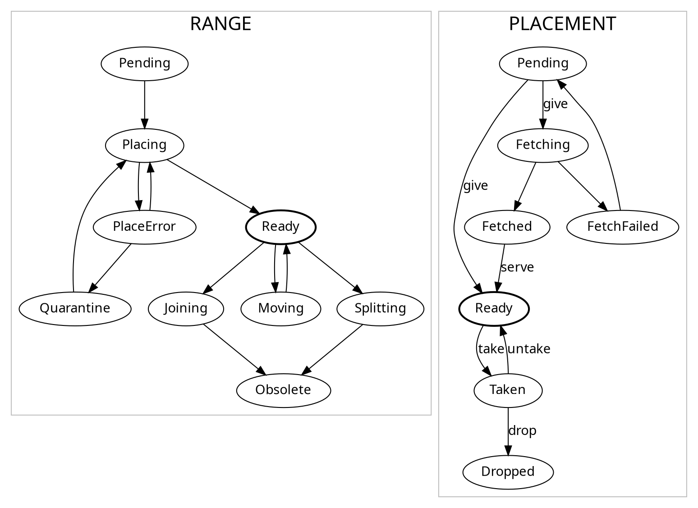

# Ranger

This is an experiment to define a generic interface for stateful range-sharded
distributed storage systems to implement, and a generic master to load-balance
keys between them.

## Development

Install development deps

```console
$ brew install protoc-gen-go
$ brew install protoc-gen-go-grpc
```

Install local runtime deps

```console
$ brew install consul
```

Regenerate the files in `pkg/proto`

```console
$ bin/gen-proto.sh
$ examples/kv/bin/gen-proto.sh
```

## State Machine



## Objects

### stateful

this stuff lives in a durable store, which must always be kept up to date. no
local state.

```text
keyspace
- next_id
- []range
  - id
  - [2]placement # current, next
    - id
    - node_id # <- where it is _expected_ to be
    - state # needed? can maybe be inferred
```

### volatile

this stuff is gathered at startup, and kept up to date during runtime.

```text
roster
- []node
  - id
  - host
  - port

  - utilization
    - cpu?
    - memory?
    - network?
    - disk?
  
  - vplacement
    - state
    - utilization # as above
```
